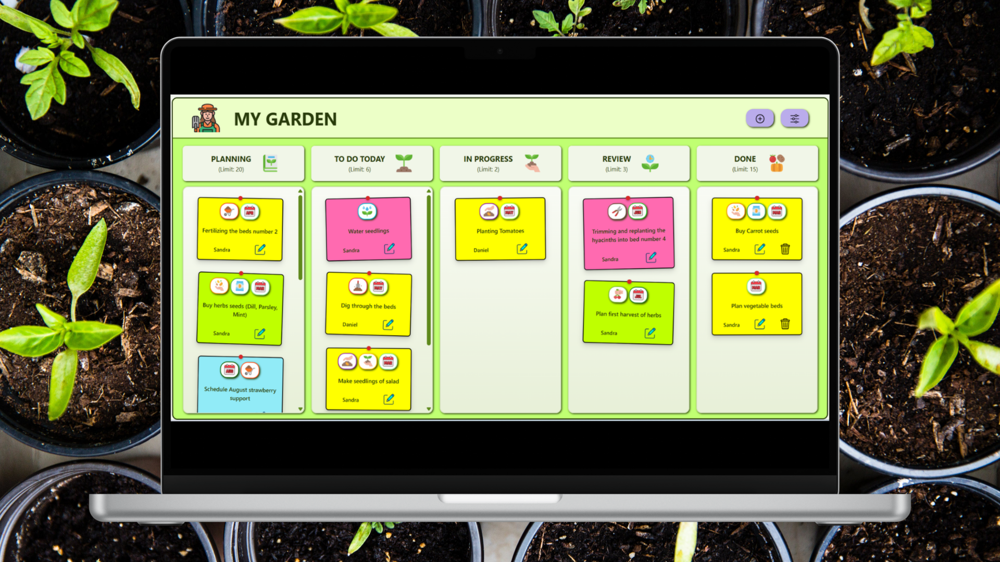

# 🌱 My Garden Kanban

**My Garden Kanban** is a responsive Kanban board designed to help gardeners organize and manage their garden tasks.  
Users can create, edit, move, filter, and delete tasks through an intuitive interface.

🔗 **Live Demo:**  [https://my-garden-kanban.vercel.app/](https://my-garden-kanban.vercel.app/)

----------

## ✨ Features

-   Create tasks using a **modal form with inline validation**
-   **Inline editing** of task content
-   **Drag & Drop** task movement on desktop
-   **Arrow navigation** between columns on smaller screens
-   **Task limit per column** with toast notifications
-   **Delete option** for tasks in the final column with confirmation modal
-   **Label filtering** in a sidebar (multiple labels supported)
-   **Clear filters** with a single button
-   Tasks persist using **Local Storage**

----------

## ⚙️ Technologies

-   **React**
-   **Vite**
-   **React Context API** – global state management
-   **Custom Hooks**
-   **React Portal** – modal rendering
-   **Local Storage**
-   **Styled Components** 

----------

## 📱 Responsiveness

-   **Desktop:** drag & drop interaction
-   **Mobile / smaller screens:** arrow navigation between columns

----------
## 🧠 Engineering Focus

This project demonstrates understanding of:

- State management using **React Context**  
- Task persistence using **Local Storage**  
- Drag & Drop interactions and responsive task navigation  
- Separation of **UI and business logic** using custom hooks  
- Modal architecture implemented with **React Portal**  
- Inline form validation and user feedback with **toast notifications**  
- Scalable folder structure  
- Responsive UX decisions for both **desktop and smaller screens**
- Clean Git workflow (Conventional Commits). This reflects professional development workflow and team-ready practices.

----------

## 📌 **Summary**

This project focuses on practicing **interactive UI development, state management with React Context, and building reusable components with custom hooks**.

I am also a **hobby gardener**, so this application reflects a real problem I experience while planning garden work. The Kanban board helps organize tasks such as planting, watering, and harvesting in a clear workflow.

----------

🤝  **Let’s Connect**

If you are interested in this project or would like to discuss my experience,  
feel free to contact me.

I am currently looking for a  **Junior Frontend Developer opportunity**  and would be happy to talk about how I can contribute to your team.

📧 Email:  **[sandra.mstowskaa@gmail.com](mailto:sandra.mstowskaa@gmail.com)**  
💼 LinkedIn:  **[https://www.linkedin.com/in/sandra-mstowska-962368376/](https://www.linkedin.com/in/sandra-mstowska-962368376/)**
